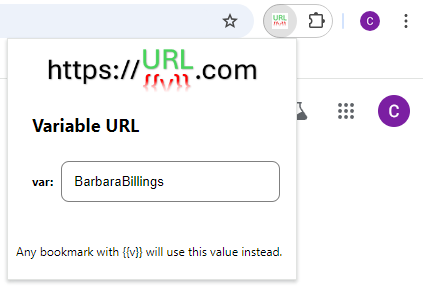

# Variable URL

Do you have a set of links with a common, but variable, component? Consider the following table:

||one url|another url|
|--|--|--|
|1|someuniversity.edu/students/AdamApplegate/summary|someuniversity.edu/students/AdamApplegate/grades/1|
|2|someuniversity.edu/students/BarbaraBillings/summary|someuniversity.edu/students/BarbaraBillings/grades/1|

If you want to bookmark a link for the student summary, and another link for the student's grade on the first assignment, you will end up needing to duplicate those bookmarks for each student. This quickly becomes infeasible to the point that bookmarks are dismissed as not a useful approach to navigating these pages. However, if there is not an admin panel, some use cases may not have a better option either.

With Variable URL, you can bookmark the set of pages once, and define the variable component inside of a chrome extension.

## How To Use

First, go to `chrome://extensions`. Search for and add VariabURL.

In the (normal, existing) chrome bookmark manager, add or edit bookmarks to replace the variable component with `{{v}}`. Extending the example above, these bookmarks might be:

- `someuniversity.edu/students/{{v}}/summary`
- `someuniversity.edu/students/{{v}}/grades/1`

Using the extensions widget to the right of the address bar in chrome, select the VariabURL extension, and enter a value for the variable. Be sure to hit `Enter`, `Tab`, or otherwise click outside of the text box to confirm the value.

You're ready to go! Your links will now use the value defined in the VariabURL extension whenever navigating to a URL with `{{v}}` in it. From a practical perspective, this is mainly bookmarks, but any links or redirects constructed this way will use the variable value as well. If you are having unexpected behavior outside of the use of your bookmarks based on a URL including `{{v}}` in a literal sense, you may need to disable the extension.

## Contributing

This extension has been left intentionally basic. One can imagine various ways it could be extended upon.

- Security: there are obvious security implications regarding injection attacks when text can be injected into a URL. The text is URL encoded, but there is likely room for further improvement.
- Multiple variables: perhaps it would make sense to allow the user to define the variable name as well as its value, and add an arbitrary number of these variables.
- Filtering: the `onBeforeNavigate` event [filter argument](https://developer.mozilla.org/en-US/docs/Mozilla/Add-ons/WebExtensions/API/webNavigation/onBeforeNavigate#filter) is being used to check for the presense of the variable. Performance or security could be improved by adding [other conditions](https://developer.mozilla.org/en-US/docs/Mozilla/Add-ons/WebExtensions/API/events/UrlFilter).
